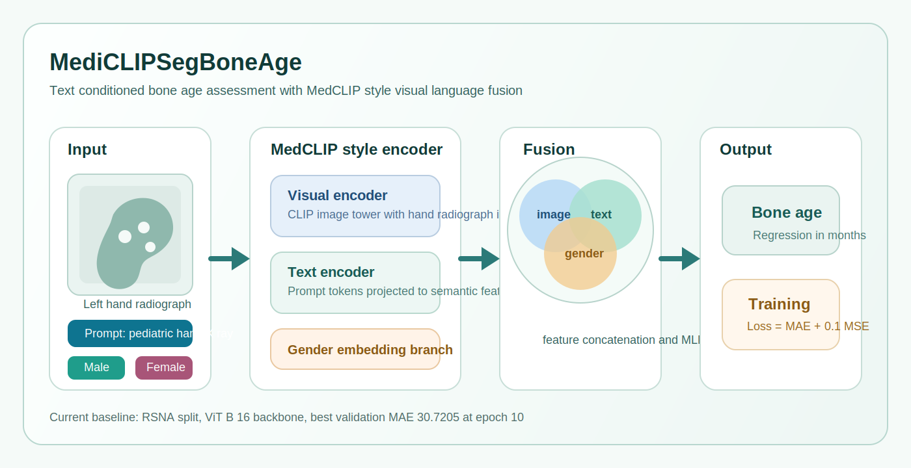
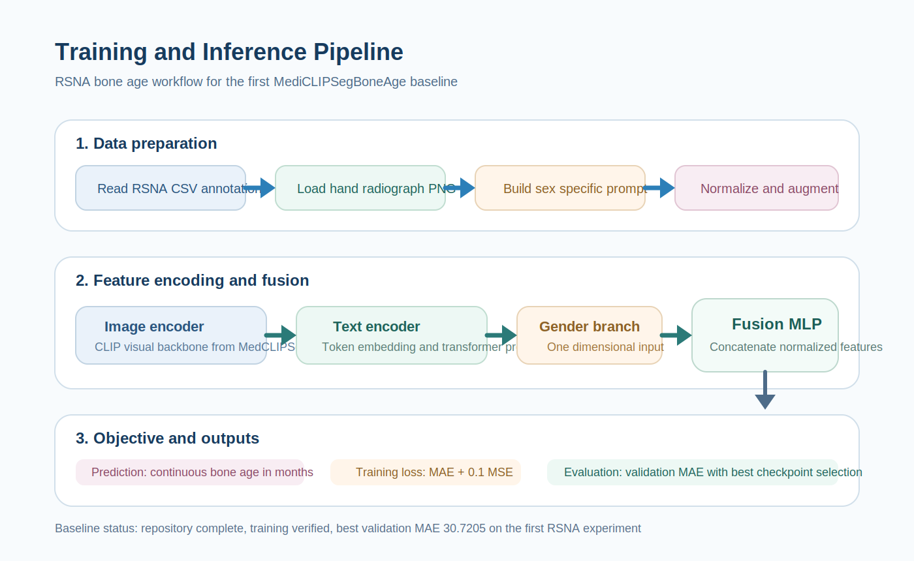

# MediCLIPSegBoneAge



MediCLIPSegBoneAge is a starter project for adapting MedCLIPSeg style vision language modeling to pediatric bone age assessment. The current repository contains a first working baseline for RSNA bone age regression, built as a standalone research codebase with a MedCLIP inspired text conditioned image encoder and a simple fusion head for image features, prompt features, and gender metadata.



## Project layout

```text
MediCLIPSegBoneAge/
├── configs/
├── mediclipsegboneage/
├── scripts/
├── train.py
└── README.md
```

## Current scope

This initial version trains a text conditioned CLIP based bone age regressor on RSNA style CSV annotations. The model uses:

- image encoder from the local `MedCLIPSeg` project
- prompt encoder for task text
- learnable fusion of image features, text features, and gender metadata
- MAE regression objective

The current prompt template is intentionally side agnostic: `hand radiograph for bone age assessment of a male pediatric patient` or the corresponding female variant. This avoids injecting incorrect left right assumptions when the dataset contains both hands.

## First baseline

The first completed baseline was trained on the RSNA split for 10 epochs. The best validation result was obtained at epoch 10 with `val_mae = 30.7205`.

| Epoch | Train MAE | Val MAE | Val Loss | LR |
| --- | ---: | ---: | ---: | ---: |
| 1 | 47.5851 | 32.3768 | 200.0837 | 1e-4 |
| 4 | 32.8038 | 32.2359 | 200.4504 | 1e-4 |
| 5 | 32.5282 | 31.2861 | 189.1032 | 1e-4 |
| 6 | 31.4517 | 30.8666 | 180.1267 | 1e-4 |
| 7 | 31.5487 | 30.7430 | 178.5027 | 1e-4 |
| 10 | 31.0308 | 30.7205 | 178.4001 | 1e-4 |

The full training history used for this baseline is stored in [results/rsna_clip_baseline_history.csv](/data/hxly/projects/MediCLIPSegBoneAge/results/rsna_clip_baseline_history.csv). The local training artifacts are:

- best checkpoint: `outputs/rsna_clip_baseline/best.pt`
- last checkpoint: `outputs/rsna_clip_baseline/last.pt`
- raw history file: `outputs/rsna_clip_baseline/history.csv`

Training log summary:

```text
Epoch 005 | train loss=197.7099 mae=32.5282 | val loss=189.1032 mae=31.2861 | lr=0.0001000
Saved new best checkpoint with val_mae=31.2861
Epoch 006 | train loss=189.0268 mae=31.4517 | val loss=180.1267 mae=30.8666 | lr=0.0001000
Saved new best checkpoint with val_mae=30.8666
Epoch 007 | train loss=189.2668 mae=31.5487 | val loss=178.5027 mae=30.7430 | lr=0.0001000
Saved new best checkpoint with val_mae=30.7430
Epoch 008 | train loss=181.8035 mae=30.7032 | val loss=179.0077 mae=30.9678 | lr=0.0001000
Epoch 009 | train loss=183.1067 mae=30.8954 | val loss=191.3968 mae=31.9023 | lr=0.0001000
Epoch 010 | train loss=185.1844 mae=31.0308 | val loss=178.4001 mae=30.7205 | lr=0.0001000
Saved new best checkpoint with val_mae=30.7205
```

## Prompt comparison baseline

After removing the fixed left hand wording from the prompt and switching to a side agnostic template, the model was trained again as a controlled comparison. The best validation result in this run was `val_mae = 31.2888` at epoch 11.

| Setting | Prompt template | Best epoch | Best val MAE |
| --- | --- | ---: | ---: |
| Baseline A | `left hand radiograph for bone age assessment of a {sex} pediatric patient` | 10 | 30.7205 |
| Baseline B | `hand radiograph for bone age assessment of a {sex} pediatric patient` | 11 | 31.2888 |

This comparison suggests that the current prompt wording has limited impact on overall performance, and the model is still driven mainly by image features and the structured gender input.

Training log summary for the side agnostic prompt run:

```text
Epoch 001 | train loss=440.6374 mae=47.5488 | val loss=200.8173 mae=32.4972 | lr=0.0001000
Saved new best checkpoint with val_mae=32.4972
Epoch 002 | train loss=201.4974 mae=32.8536 | val loss=199.9044 mae=32.9225 | lr=0.0001000
Epoch 003 | train loss=202.4444 mae=32.9591 | val loss=199.6082 mae=32.6562 | lr=0.0001000
Epoch 004 | train loss=200.8079 mae=32.8685 | val loss=201.3649 mae=32.3400 | lr=0.0001000
Saved new best checkpoint with val_mae=32.3400
Epoch 005 | train loss=199.8717 mae=32.7658 | val loss=199.5208 mae=32.6642 | lr=0.0001000
Epoch 006 | train loss=200.6411 mae=32.7891 | val loss=200.5902 mae=33.0842 | lr=0.0001000
Epoch 007 | train loss=201.2324 mae=32.8094 | val loss=199.6376 mae=32.8214 | lr=0.0000500
Epoch 008 | train loss=200.7900 mae=32.7540 | val loss=199.4989 mae=32.6905 | lr=0.0000500
Epoch 009 | train loss=199.7491 mae=32.7083 | val loss=199.4743 mae=32.6038 | lr=0.0000500
Epoch 010 | train loss=200.2154 mae=32.7587 | val loss=199.6174 mae=32.8341 | lr=0.0000250
Epoch 011 | train loss=195.3042 mae=32.3066 | val loss=189.3358 mae=31.2888 | lr=0.0000250
Saved new best checkpoint with val_mae=31.2888
```

## Expected data format

The dataset loader expects:

- images in one folder, named as `<ID>.png`
- CSV files with columns `ID`, `Male`, and `Boneage` for labeled splits

## Quick start

```bash
python train.py \
  --image-dir /data/hxly/datasets/BoneAge/RSNA/rsna_all \
  --train-csv /data/hxly/datasets/BoneAge/RSNA/annotations/RSNA_Annotations/RSNA_Boneage_Training.csv \
  --val-csv /data/hxly/datasets/BoneAge/RSNA/annotations/RSNA_Annotations/RSNA_Boneage_Validation.csv \
  --output-dir outputs/rsna_clip_baseline
```

## Next steps

The current code is a clean starting point. The next research upgrades worth doing are:

- replace global CLIP pooling with patch token pooling from MedCLIPSeg
- add a hand region branch or external hand mask
- compare generic prompts and age aware prompt templates
- test uncertainty aware regression heads
